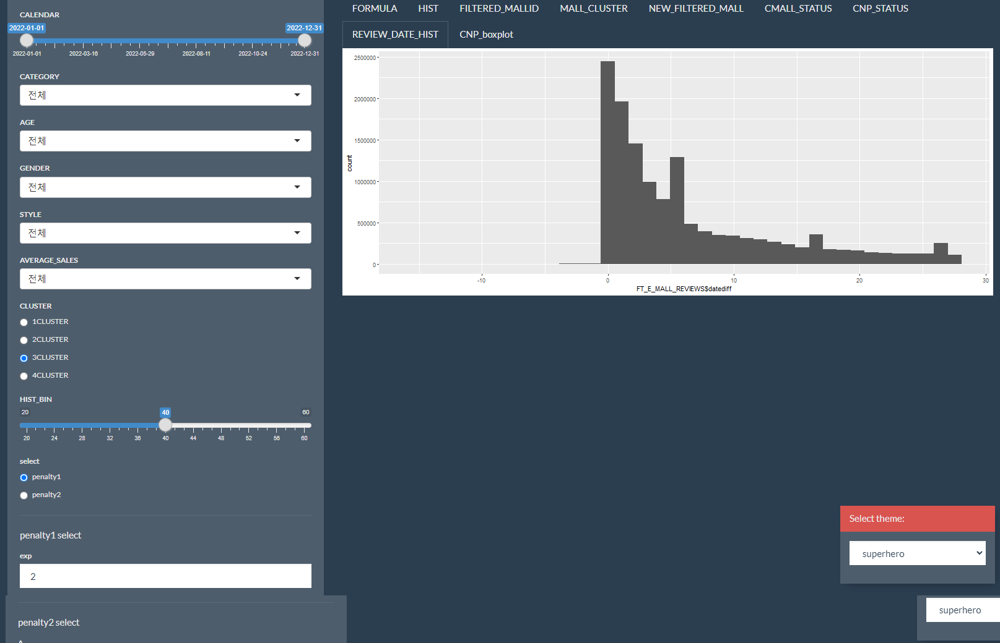

# 샤이니 대시보드

## 제작 목적
파워 BI 대시보드 제작 시 전처리 데이터 검수 및 경쟁 그룹 특징 파악을 위해 제작

## 탭
FORMULA : 대시보드 리뷰 점수 패널티 함수 시각화  
HIST : 측면으로 치우친 분포의 중앙값과 평균 시각화  
FILTERED_MALLID : 세그먼트를 선택할 경우 해당 몰ID 파악  

>MALL_CLUSTER : 유사 몰 군집의 리뷰 긍부정 비율 파악을 위해 kmeans clustering  

NEW_FILTERED_MALL : 선택한 클러스터에 해당하는 몰ID 파악  

>CMALL_STATUS : 선택한 클러스터에 해당하는 몰 정보  

CNP_STATUS : 선택한 클러스터에 해당하는 몰의 키워드 긍부정 키워드 수  

>REVIEW_DATA_HIST : 배송완료 소요 시간 파악  

>CNP_boxplot : 선택한 클러스터에 해당하는 몰의 키워드 긍부정 키워드 수 박스 플롯  

